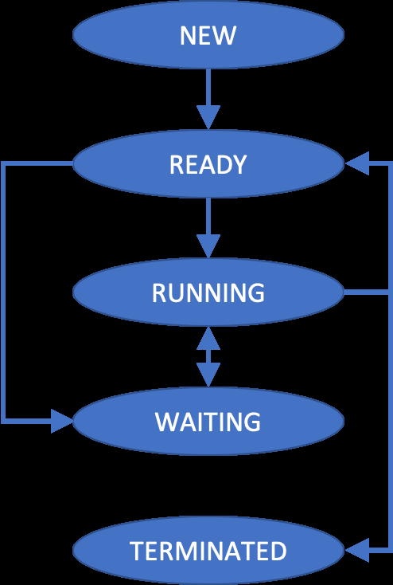

## Question 1

Write the code of a program that can be used to make a copy of a certain file, specified by the user. This program should be run by two threads T1 and T2 belonging to two different processes P1 and P2. T1 belongs to P1, and T2 belongs to P2. T1 is the thread responsible for asking which file to copy, and the file name of the copy, while T2 is the thread responsible for making the actual copy.

<!-- answer:start -->

### Answer

Use two processes, for example by calling `fork()`. One process asks the user for the source and destination file names, and the other process performs the copy. The two processes can communicate the file names through a pipe, although other inter-process communication mechanisms are also possible.

<!-- answer:end -->


## Question 2

Why does the OS define a "terminated" state for a process and not simply end the process? Provide an example of when this is useful.

<!-- answer:start -->

### Answer

The terminated state lets the operating system keep information about a process after it has finished, so that other processes can still retrieve that information. For example, a terminated child process may remain as a zombie until its parent collects its termination status.

<!-- answer:end -->


## Question 3

Indicate which connections are wrong and which ones are correct in the following figure. For each wrong or missing connection, explain why you think the connection is either wrong or missing.

{ width=55% }

<!-- answer:start -->

### Answer

The correct connections in the figure are:

- NEW -> READY: a newly created process is admitted and becomes ready.
- READY -> RUNNING: the scheduler dispatches a ready process to the CPU.
- RUNNING -> READY: a running process can be preempted and return to the ready queue.
- RUNNING -> WAITING: a running process can block while waiting for an event, such as I/O.
- RUNNING -> TERMINATED: a running process can finish execution and terminate.

The wrong connections in the figure are:

- READY -> WAITING is wrong because a process should not become waiting before it has run. A process normally blocks while it is running.
- WAITING -> RUNNING is wrong because when the event a process was waiting for occurs, the process becomes ready. It should not skip the ready state and run directly.

The missing connection is:

- WAITING -> READY is missing. When the event a waiting process is blocked on occurs, the process should move back to the ready state.

<!-- answer:end -->


## Question 4

Is the following code going to print `Greetings` or not? Explain why. The listing contains only the relevant portions of code, so the answer does not need to take minor inconsistencies, such as missing include statements, into account.

```c
int main(void)
{
    char write_msg[BUFFER_SIZE] = "Greetings";
    char read_msg[BUFFER_SIZE];
    pid_t pid;
    int fd[2];

    /* now fork a child process */
    pid = fork();

    /* create the pipe */
    if (pipe(fd) == -1) {
        fprintf(stderr, "Pipe failed");
        return 1;
    }

    if (pid < 0) {
        fprintf(stderr, "Fork failed");
        return 1;
    }

    if (pid > 0) { /* parent process */
        /* close the unused end of the pipe */
        close(fd[READ_END]);
        /* write to the pipe */
        write(fd[WRITE_END], write_msg, strlen(write_msg) + 1);
        /* close the write end of the pipe */
        close(fd[WRITE_END]);
    }
    else { /* child process */
        /* close the unused end of the pipe */
        close(fd[WRITE_END]);
        /* read from the pipe */
        read(fd[READ_END], read_msg, BUFFER_SIZE);
        printf("child read %s\n", read_msg);
        /* close the write end of the pipe */
        close(fd[READ_END]);
    }
    return 0;
}
```

<!-- answer:start -->

### Answer

No. The pipe is created after `fork()`, so the parent and child do not share the same pipe. Each process creates its own separate pipe after the fork. The parent writes to its own pipe, while the child reads from a different pipe, so the child does not receive `Greetings`.

<!-- answer:end -->
